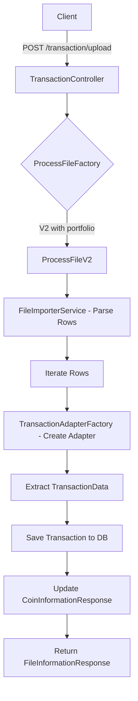
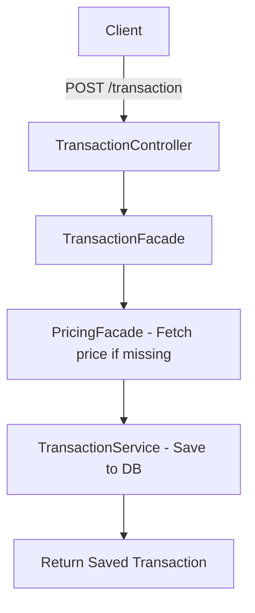

# Architecture and Flow

> **Source of Truth**: For detailed engineering principles, see [Engineering Standard](engineering-standard.md).

## Transaction Upload Flow

This application supports two main ways to ingest transactions:
1. **File Upload (CSV/Excel)**: Via `/transaction/upload` or `/transaction/upload/{portfolio}`.
2. **Manual POST**: Via `/transaction` (POST).

### File Upload Flow Diagram

### Manual Transaction Flow

## API Details

### Transaction APIs (`/transaction`)
- `GET /filter`: Filter transactions with pagination (symbol, side, portfolio, dates, etc.).
- `POST /information`: Get summary for a specific symbol.
- `POST /information/all`: Get summary for all symbols.
- `POST /information/all/{portfolio}`: Get summary for all symbols in a specific portfolio.
- `POST /upload`: Upload CSV/Excel for Binance/MEXC.
- `POST /upload/{portfolio}`: Upload and assign to a specific portfolio.
- `GET /portfolio`: Build portfolio from symbols.
- `DELETE /`: Delete all transactions.
- `POST /`: Add a manual transaction.

### Holding APIs (`/holding`)
- `GET /`: Get holdings by symbol.
- `POST /add`: Add a single holding manually.
- `POST /addMultiple`: Add multiple holdings.

### Portfolio APIs (`/portfolio`)
- `GET /`: Get portfolio distribution by name.
- `GET /names`: List all portfolio names.
- `POST /distribution`: Calculate portfolio value in BTC and USDT.
- `GET /{portfolioName}/{symbol}`: Get specific holding in a portfolio.
- `GET /download`: Download portfolio as Excel.

## Accounting Principles

InvestTracker follows standard financial accounting adapted for the crypto market:

- **Cost Basis (Average Cost)**: Calculated using the weighted average of all BUY transactions for a given asset. This provides a stable entry price reference, crucial for tracking "buying the dip" efficiency.
- **Realized Profit/Loss**: Recognized immediately upon a SELL transaction. It is the difference between the sale proceeds and the proportional cost basis of the assets sold.
- **Unrealized Profit/Loss**: The delta between current Market Value (fetched via PricingFacade) and the remaining Total Cost (Cost Basis * Current Holding).
- **Non-Stable Trades (Crypto-to-Crypto)**: When trading BTC for ETH, the system treats it as two simultaneous events: a sell of BTC and a buy of ETH, ensuring cost basis is correctly updated for both assets in USDT terms.
- **Stable Coins**: USDT, DAI, BUSD, UST, USD, USDC are treated as stable anchors for cost calculation.
