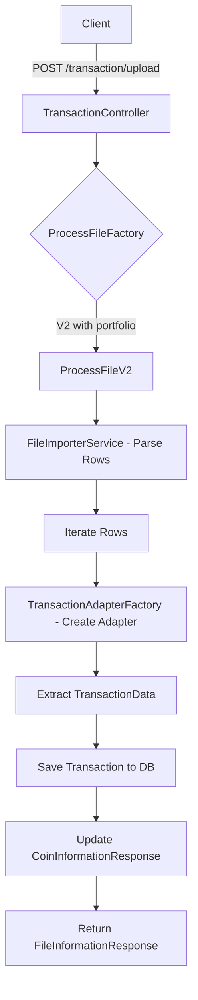
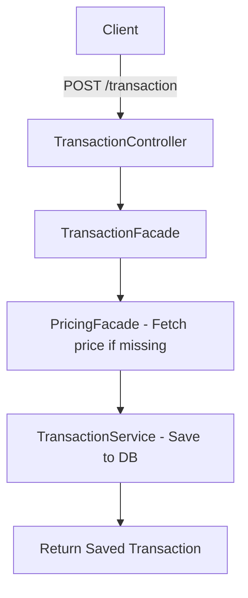

# Architecture & Engineering Standard

This is the single source of truth for how InvestTracker is built: layered architecture, coding standards, testing strategy, and the two main request flows. (Formerly split across `architecture-and-flow.md` and `engineering-standard.md` — merged 2026-09-12.)

## 1. Layered Architecture

```
Controller → Facade → Service → Repository → Entity (JPA)
```

- **Controller**: endpoint definition, request validation, OpenAPI documentation (`@Tag`/`@Operation`/`@ApiResponse`/`@Parameter` — see [api-documentation-guide.md](api-documentation-guide.md)).
- **Facade**: orchestration of multiple services. Should **not** contain core business logic.
- **Service**: core business logic — domain-specific rules (accounting, parsing, exchange sync).
- **Repository**: data access (Spring Data JPA).
- **Entity**: database mapping.

**DRY**: if logic for "amount in USDT" or price conversion already exists in `OperationUtils` or `PricingFacade`, use it — don't reimplement it in another service.

### Where accounting logic actually lives today

> **Correction (2026-09-12):** older docs in this repo referred to a `TransactionProcessor` class as "the single source of truth for all accounting logic." That class was **intentionally removed** by PR #60 (eager → lazy transaction processing) in favor of on-demand evaluation in `CoinInformationService`, plus `CalculateAmountSpent` for the USDT-amount usecase. If you find a doc, comment, or test mock referencing `TransactionProcessor`, it's stale — the class doesn't exist in `src/main` anymore (it does still linger as a broken `Mock(TransactionProcessor)` in `BinanceSyncServiceSpec.groovy`, which is a separate, already-tracked pre-existing test issue, not a documentation problem).

That same PR (#60) renamed `stableTotalCost` → `inventoryCostUsdt`, but **the rename is incomplete**: both names currently exist side by side in different layers —
- `stableTotalCost` still lives in: `CoinInformationResponse`, `TransactionHoldingDto`, `AddHoldingRequest`, `TransactionFacade`, `CalculateAmountSpent`
- `inventoryCostUsdt` lives in: `HoldingDto`, `HoldingConverter`, the `Holding` entity, `PortfolioDistributionFacade`, `CoinInformationService`

Finishing this rename consistently across all layers is a tracked open item — see [roadmap.md](roadmap.md).

## 2. Coding Standards

- **Java 17** (build target; see `build.gradle` — note `sourceCompatibility = '11'` is set for language-level compatibility, but the project builds/runs on JDK 17/21 — see `investracker/CLAUDE.md`'s Docker section) + Spring Boot 2.7. Use `@RequiredArgsConstructor` (Lombok) for dependency injection.
- **Clean Code / SOLID**: single responsibility per class (e.g. `ProcessFileV2` handles the file-upload flow, `CoinInformationService` handles accounting). Use interfaces/factories (`ProcessFileFactory`, `TransactionAdapterFactory`) to extend without modifying.
- **Explicit naming**: domain-driven names (`inventoryCostUsdt`/`stableTotalCost` rather than `cost`) — see the naming-inconsistency note above.
- **Accounting precision**: always `BigDecimal`. Scale of at least 8 decimals for crypto amounts, 10 for intermediate calculations. Round `HALF_UP`.

## 3. Testing Strategy

- **Spock + Groovy** for all new features — `given/when/then` blocks, tests readable as documentation.
  - Unit tests: `src/test/groovy/`, mock collaborators with `Mock()`.
  - Integration tests: `src/integration-test/groovy/`, extend `BaseIntegrationSpec` (TestContainers-backed Postgres).
- Complex behavior should be documented as a scenario in [accounting-scenarios.md](accounting-scenarios.md) first — code should satisfy the scenario, not the other way around.
- Current known coverage gaps: see [testing.md](testing.md).

## 4. Documentation

- Every new feature or significant change should be reflected in `/docs`.
- Keep this file's flow diagrams current when the ingestion/query flow changes.
- Every controller method needs `@Operation` + `@ApiResponse` (see [api-documentation-guide.md](api-documentation-guide.md)).

## 5. Definition of Done

1. Code follows the principles above.
2. Unit and/or integration tests pass.
3. Test coverage meets target (80% line / 70% branch).
4. Documentation is updated.
5. Swagger UI reflects the change.

---

## 6. Request Flows

### File Upload Flow



### Manual Transaction Flow



## 7. Core API Reference

For the full exchange-integration endpoint reference (Binance/MexC/IOL), see [exchange-integrations.md](exchange-integrations.md). Everything else:

### Transaction APIs (`/transaction`)
- `GET /filter` — filter transactions with pagination (symbol, side, portfolio, dates, etc.)
- `POST /information` — summary for a specific symbol
- `POST /information/all` — summary for all symbols
- `POST /information/all/{portfolio}` — summary for all symbols in a portfolio
- `POST /upload` — upload CSV/Excel (deprecated, no portfolio assignment)
- `POST /upload/{portfolio}` — upload and assign to a portfolio
- `GET /portfolio` — build portfolio from symbols
- `DELETE /` — delete all transactions
- `POST /` — add a manual transaction

### Holding APIs (`/holding`)
> Note: not `/api/holdings` — several older docs had this wrong; verified against `HoldingController`'s actual `@RequestMapping`.
- `GET /` — get holdings by symbol
- `POST /add` — add a single holding manually
- `POST /addMultiple` — add multiple holdings

### Portfolio APIs (`/portfolio`)
> Note: not `/api/portfolio/...` — same class of error as above, verified against `PortfolioController`.
- `GET /` — get portfolio distribution by name
- `GET /names` — list all portfolio names
- `POST /distribution` — calculate portfolio value in BTC and USDT
- `GET /{portfolioName}/{symbol}` — get a specific holding in a portfolio
- `GET /download` — download portfolio as Excel

## 8. Accounting Principles

- **Cost Basis (Average Cost / AVCO)**: weighted average of all BUY transactions for a given asset.
- **Realized Profit/Loss**: recognized immediately on SELL — sale proceeds minus the proportional cost basis of the units sold.
- **Unrealized Profit/Loss**: current market value (via `PricingFacade`) minus remaining cost basis.
- **Non-stable trades (crypto-to-crypto)**: e.g. BTC→ETH is treated as two simultaneous events (a BTC sell + an ETH buy), so cost basis updates correctly for both assets in USDT terms.
- **Stable coins** (`OperationUtils.STABLE`): `USDT, DAI, BUSD, USD, USDC, TUSD, FDUSD` — treated as $1 anchors for cost-basis math.
  > **Correction (2026-09-12):** an older version of this doc listed `UST` as a recognized stable coin — that was describing a real bug (`docs/accounting-scenarios.md`'s Tech Lead Analysis flagged it as live) where the depegged Terra stablecoin was valued at $1 instead of its real ~$0.01 market price. **This has since been fixed** — `UST`/`USTC` is not in `OperationUtils.STABLE` today.
