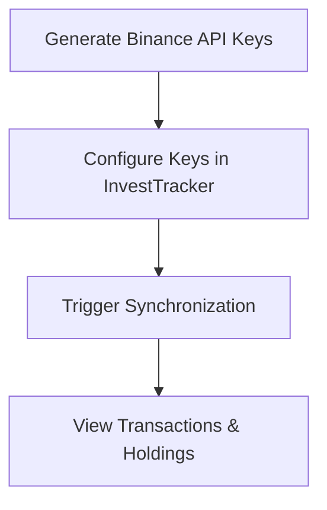

# Binance Integration Guide

This guide explains how to connect your Binance account to InvestTracker to automatically sync your trading history.

## Setup Flow



## Step 1: Generate Binance API Keys
1. Log in to your Binance account.
2. Navigate to **API Management**.
3. Create a new API Key (System Generated).
4. **Security Note**: 
   - Enable **"Enable Reading"**.
   - **DO NOT** enable "Enable Spot & Margin Trading" or "Enable Withdrawals". InvestTracker only needs read access.
5. Copy your **API Key** and **Secret Key**.

## Step 2: Configure Keys in InvestTracker
Use the following API call to securely store your credentials:

```bash
curl -X POST http://localhost:9080/api/exchange/config \
  -H "Authorization: Bearer <YOUR_JWT_TOKEN>" \
  -H "Content-Type: application/json" \
  -d '{
    "exchangeName": "BINANCE",
    "apiKey": "your_api_key_here",
    "apiSecret": "your_api_secret_here"
  }'
```

## Step 3: Trigger Synchronization

### Quick Sync (New Trades Only)
If you just want to fetch recent trades for symbols with active balances:
```bash
curl -X POST "http://localhost:9080/transaction/sync/binance?portfolio=MyMainPortfolio" \
  -H "Authorization: Bearer <YOUR_JWT_TOKEN>"
```

### Full Historical Sync (Recommended for First Time)
To build your portfolio from scratch, including all historical trades, deposits, withdrawals, fiat orders, and conversions:
```bash
curl -X POST "http://localhost:9080/transaction/sync/binance/full?portfolio=MyMainPortfolio" \
  -H "Authorization: Bearer <YOUR_JWT_TOKEN>"
```

## Step 4: Verify Results
Check your updated holdings:

```bash
curl -H "Authorization: Bearer <YOUR_JWT_TOKEN>" http://localhost:9080/api/holdings
```

## Technical Notes for Engineers
- **Incremental Sync**: The system stores the `lastSyncTimestamp`. Subsequent calls will only fetch trades that occurred after the last successful sync.
- **Auto-Discovery**: You don't need to specify symbols. The system automatically finds all pairs you have traded by checking your account balances.
- **Encryption**: Secrets are encrypted using AES-256 before being persisted to the database.
