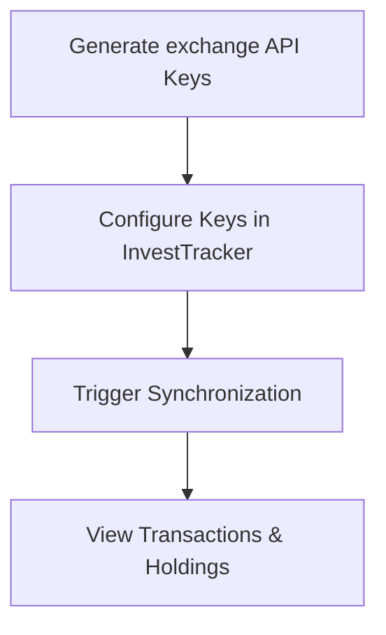

# Exchange Integrations: Binance, MexC, IOL

Everything about connecting an exchange/broker account, syncing history, and querying results — merged 2026-09-12 from `BINANCE_INTEGRATION.md`, `binance-setup-guide.md`, `exchange-integrations-guide.md`, and `postman-api-guide.md` (which had almost the same "configure → sync → verify" flow repeated three times, with the same wrong endpoint copy-pasted into all three).

## 1. Overview

InvestTracker acts as a centralized hub for multiple exchanges/brokers. It abstracts away exchange-specific complexity (rate limiting, request signing, token management) and normalizes everything into one data model.

| Exchange | Auth Method | Sync Types | Implementation |
|----------|-------------|------------|-----------------|
| **Binance** | API Key / Secret | Trades, Deposits, Withdrawals, Fiat, Convert | WebClient (reactive), HMAC-SHA256 signing |
| **MexC** | API Key / Secret | Trades, Deposits, Withdrawals | WebClient (reactive), HMAC-SHA256 signing |
| **IOL** (InvertirOnline) | OAuth2 (username/password) | Balances, Portfolio, Operations | Feign Client + Caffeine token caching |

### Unified data model

- **Transaction** — an atomic movement: `side` (BUY/SELL/DEPOSIT/WITHDRAW), `symbol`, `pair`, `executed` (quantity), `price`, `paidAmount`.
- **Holding** — calculated per-asset state within a portfolio: current amount, average cost basis, realized profit.
- **Portfolio** — a logical grouping of transactions/holdings (e.g. "MyMainPortfolio"). Saving exchange credentials automatically creates a matching portfolio.

### Security design
- Secrets are AES-encrypted at rest (`EncryptionService`) before being stored — never returned via `GET /api/exchange/config` (only `apiKey` + `lastSyncTimestamp` come back).
- Binance/MexC: HMAC-SHA256 request signing per their API security requirements.
- IOL: OAuth2 password-flow token, cached 14 minutes (tokens expire at 15) via Caffeine in `IolTokenService`.
- **Staging areas**: Binance/MexC use "raw order" staging tables so a re-process doesn't need to hit the external API again.

## 2. Setup Flow



### Step 1 — Generate API keys (Binance example)
1. Log in to Binance → **API Management** → create a new API key.
2. Enable **"Enable Reading"** only. Do **NOT** enable Spot & Margin Trading or Withdrawals — InvestTracker only needs read access.
3. Copy the API Key and Secret Key.

For MexC, the equivalent is MexC's own API Management page, same read-only principle. For IOL, no API key is generated — you use your normal InvertirOnline username/password (see the credential-flow note below).

### Step 2 — Configure credentials

```bash
curl -X POST http://localhost:9080/api/exchange/config \
  -H "Authorization: Bearer <YOUR_JWT_TOKEN>" \
  -H "Content-Type: application/json" \
  -d '{
    "exchangeName": "BINANCE",
    "apiKey": "your_api_key_here",
    "apiSecret": "your_api_secret_here"
  }'
```

Same shape for `"exchangeName": "MEXC"`. For IOL, `apiKey` holds the username and `apiSecret` holds the password (see [architecture.md](architecture.md) for the general auth model, and the IOL section below for the credential nuance).

### Step 3 — Synchronize

| Sync type | Endpoint | Behavior |
|-----------|----------|----------|
| Binance incremental | `POST /transaction/sync/binance?portfolio=<name>` | Fetches only trades since `lastSyncTimestamp`, only for currently-held assets. Synchronous, returns `"Sync initiated successfully"`. |
| MexC incremental | `POST /transaction/sync/mexc?portfolio=<name>` | Same pattern, MexC keys. |
| Binance full | `POST /transaction/sync/binance/full?portfolio=<name>&startDate=&endDate=` | Spot trades, deposits, withdrawals, fiat orders, convert trades. `startDate`/`endDate` optional epoch ms (default 2017-01-01 → now). **Async** — returns **202 Accepted** immediately, runs on `BinanceAsyncSyncService` (`@Async`), completion/failure pushed over WebSocket (`/user/queue/sync-status`). |
| MexC full | `POST /transaction/sync/mexc/full?portfolio=<name>&startDate=&endDate=` | Same async pattern as Binance full. |
| IOL | *(no explicit sync — see below)* | Data is fetched live on each request, not staged. |

If no exchange config is saved for the requested exchange, these throw `IllegalArgumentException("<Exchange> API keys not configured for user")` — the FE checks for `"not configured"` in the error message.

### Step 4 — Verify results

```bash
# Holdings (note: /holding, not /api/holdings — see architecture.md's endpoint-path corrections)
curl -H "Authorization: Bearer <YOUR_JWT_TOKEN>" http://localhost:9080/holding

# Portfolio value in BTC/USDT (note: /portfolio/distribution, not /api/portfolio/distribution)
curl -X POST -H "Authorization: Bearer <YOUR_JWT_TOKEN>" "http://localhost:9080/portfolio/distribution?portfolioName=MyMainPortfolio"
```

## 3. Direct/Diagnostic Binance Endpoints

`BinanceIntegrationController` (`/api/integration/binance`) exposes read-only proxy endpoints that hit Binance directly, bypassing the accounting layer — useful to compare Binance's raw data against what InvestTracker computed. All default `startDate` to `2020-01-01` if omitted.

| Endpoint | Purpose |
|----------|---------|
| `GET /api/integration/binance/orders?symbol=BTCUSDT` | All orders for a symbol |
| `GET /api/integration/binance/my-trades?symbol=BTCUSDT` | All filled trades for a symbol |
| `GET /api/integration/binance/deposits` | Crypto deposit history |
| `GET /api/integration/binance/withdrawals` | Crypto withdrawal history |
| `GET /api/integration/binance/fiat-orders?transactionType=0` | Fiat deposit(0)/withdraw(1) history |
| `GET /api/integration/binance/fiat-payments?transactionType=0` | Fiat buy(0)/sell(1) history |
| `POST /api/integration/binance/sync-all` | Background exhaustive order sync for all traded symbols |
| `GET /api/integration/binance/sync-status` | Per-symbol sync progress |
| `GET /api/integration/binance/raw-orders?symbol=BTCUSDT` | Previously-synced raw orders from DB (paginated) |

> **Incident note (2026-09-12):** `/my-trades` and `/orders` used to page through the requested date range in 180-day chunks, calling Binance with **both** `startTime` and `endTime` set on every chunk. Binance's real API 400s `/myTrades` and `/allOrders` whenever both timestamps are set and more than 24 hours apart (confirmed against Binance's own docs) — this had zero test coverage and went unnoticed until a real user hit the default 2020→now range. Fixed: both endpoints now page by trade/order id (`startTime` only on the first call, then an id cursor — the same pattern `BinanceApiService.getAllMyTrades()` already used correctly elsewhere) and filter the requested window in-memory. `/deposits` and `/withdrawals` had the same 180-day window where Binance's real limit is 90 days — also fixed. `/fiat-orders`/`/fiat-payments` were left at 180 days: no confirmed hard error there (Binance's docs mention an undocumented ~90-day practical data retention instead of a validation error), so there was nothing to fix without evidence — revisit if one shows up. See `BinanceIntegrationControllerSpec.groovy` for the regression tests.

## 4. IOL (InvertirOnline) Integration

Read-only integration with the Argentine broker InvertirOnline. Unlike Binance/MexC, there's no staging/sync step — data is fetched live on every request.

**Credential flow**: credentials are stored in `UserExchangeConfig` with `exchangeName = IOL`; the **username** goes in the `apiKey` field, the **password** goes in the encrypted `apiSecret` field (reusing the same config shape as Binance/MexC, just with different semantics for those two fields). `IolTokenService` exchanges these for an IOL OAuth2 access token, cached 14 minutes (IOL tokens expire at 15) via Caffeine — a fresh login only happens once the cache entry expires.

**Endpoints** (`/api/integration/iol`):

| Method | Path | Returns |
|--------|------|---------|
| GET | `/profile` | User identity, investor profile, comitente account |
| GET | `/account-statement` | ARS/USD balances across cuentas, with totals |
| GET | `/portfolio/{country}` | Holdings per market (`country`: `argentina` \| `estados_unidos`) |
| GET | `/operations` | Full operations history |
| GET | `/operations/{number}` | Single operation detail |

If no IOL config is saved, an `IllegalArgumentException` is thrown the same way as Binance/MexC.

**Auth-failure handling (fixed 2026-09-12):** `IolErrorDecoder` used to re-throw IOL's own HTTP status verbatim — e.g. a stale/wrong stored IOL password causes IOL itself to return 401 on token refresh, and that 401 reached the client unmodified. `importer-porfolio`'s global axios interceptor treats *any* 401 from *any* endpoint as "this app's session expired," logging the user out of the whole app over an IOL-specific credential problem. Fixed with an `@ExceptionHandler` in `IolIntegrationController` that remaps IOL-originated 401/403 → 424 (Failed Dependency) and anything else → 502.

## 5. Adding a New Exchange

1. Add to the `ExchangeName` enum.
2. Implement a `RawOrder`-style entity if using the staging pattern (recommended for high-volume exchanges).
3. Prefer `@FeignClient` for new integrations where the exchange's API is simple REST (see `IolClient`) — reach for `WebClient` directly only when you need reactive/streaming behavior or fine-grained control over signing (see `BinanceApiService`/`MexcApiService`).
4. Wire the new sync path's business logic into `CoinInformationService` (see [architecture.md](architecture.md) for why that's the current single source of truth, not `TransactionProcessor` — that class no longer exists).

## 6. Future: E2E Automation (proposal, not implemented)

Newman (Postman CLI) + GitHub Actions: spin up a Docker Postgres, run migrations, execute a Newman collection against the `integration-test` profile, validate DB state + JSON responses. Nothing here exists yet — this is a proposal, not current tooling.
